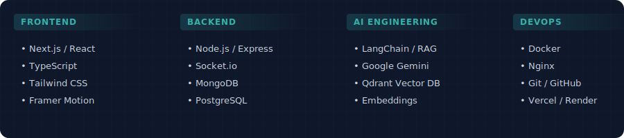
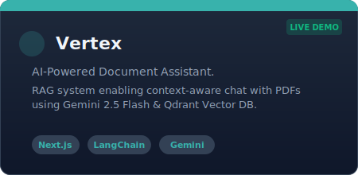
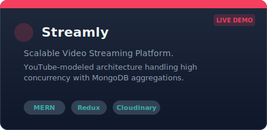
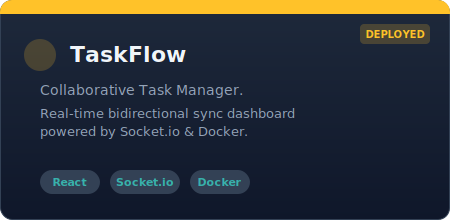

  

   

  
  
  

    <b>I build intelligent web systems that read, reason, and respond.</b> 
    Specializing in <b>Next.js</b>, <b>TypeScript</b>, and <b>Generative AI (RAG)</b> pipelines.
  

  

    
    
  

---

### 🧠 Technical Arsenal

  

 

### 💻 Featured Projects

| | | |
|:---:|:---:|:---:|
|  |  |  |

#### 🔧 Project Details

* **[Vertex](https://github.com/Aashutoshpatel11/Vertex)**: A production-grade **RAG system** that lets users chat with PDF documents. [cite_start]Features **Google Gemini 2.5**, **Qdrant Vector DB**, and **LangChain** for context-aware responses[cite: 30, 31].
* **[Streamly](https://github.com/Aashutoshpatel11/Streamly)**: A scalable video distribution platform modeled after YouTube. [cite_start]Handles high-concurrency streaming using **MERN Stack**, **Redux**, and **Cloudinary**[cite: 18, 23].
* **[TaskFlow](https://github.com/Aashutoshpatel11/TaskFlow)**: A real-time collaborative task manager. [cite_start]Uses **Socket.io** for bidirectional communication and **Docker** for containerized microservices[cite: 35, 39, 40].

---

### 📊 GitHub Activity

  
  
   

  
  

---

### 🏆 Achievements

* [cite_start]**Problem Solving:** Solved **100+** coding problems across LeetCode, GeeksforGeeks, and ChaiCode[cite: 44].
* **Certifications:**
    * [cite_start]Technology Job Simulation - *Deloitte Australia* [cite: 45]
    * [cite_start]Web Development Bootcamp - *Udemy* [cite: 45]

---

  

    
  

  <i>"Code is like humor. When you have to explain it, it’s bad."</i>

